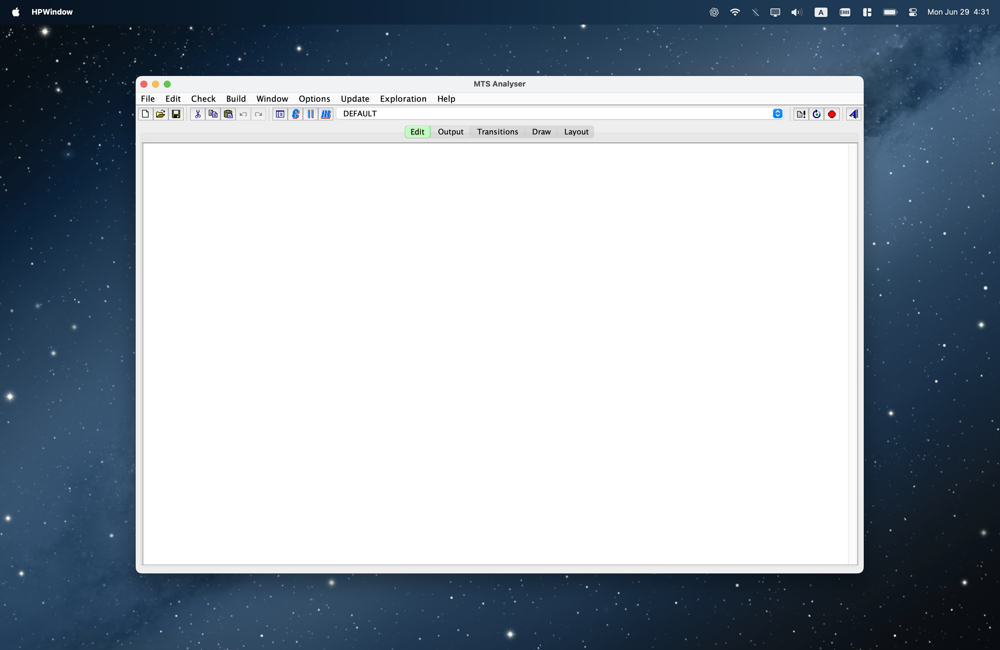
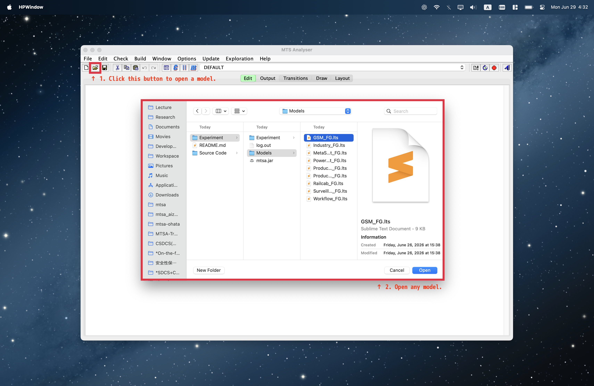
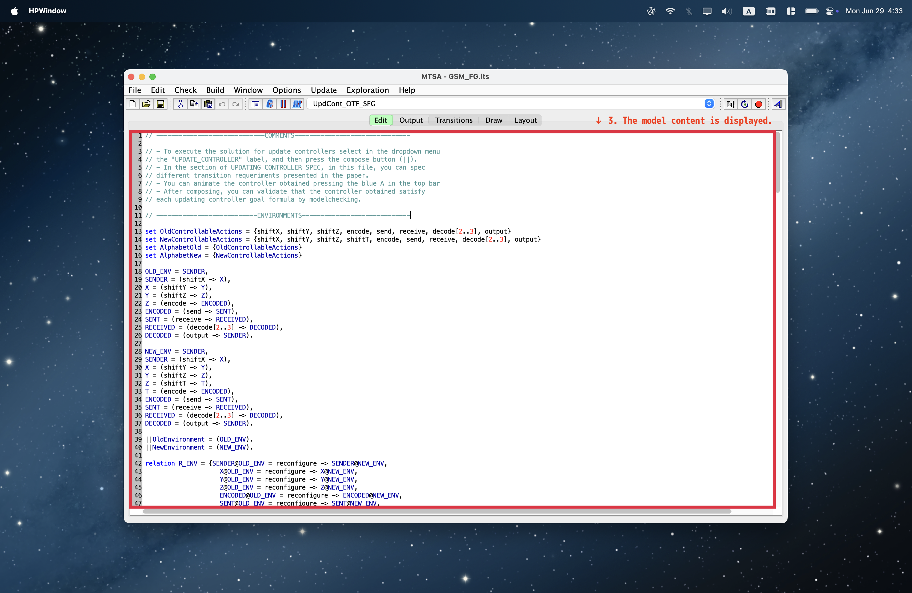
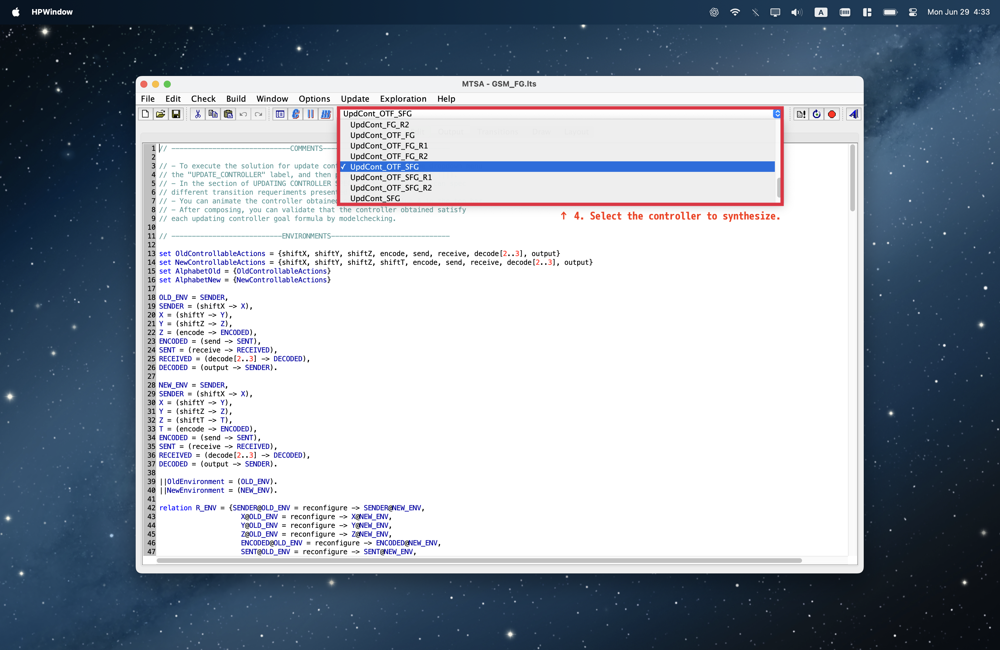
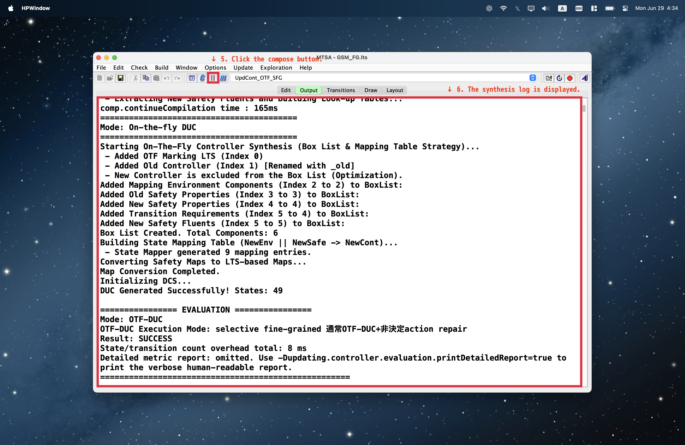
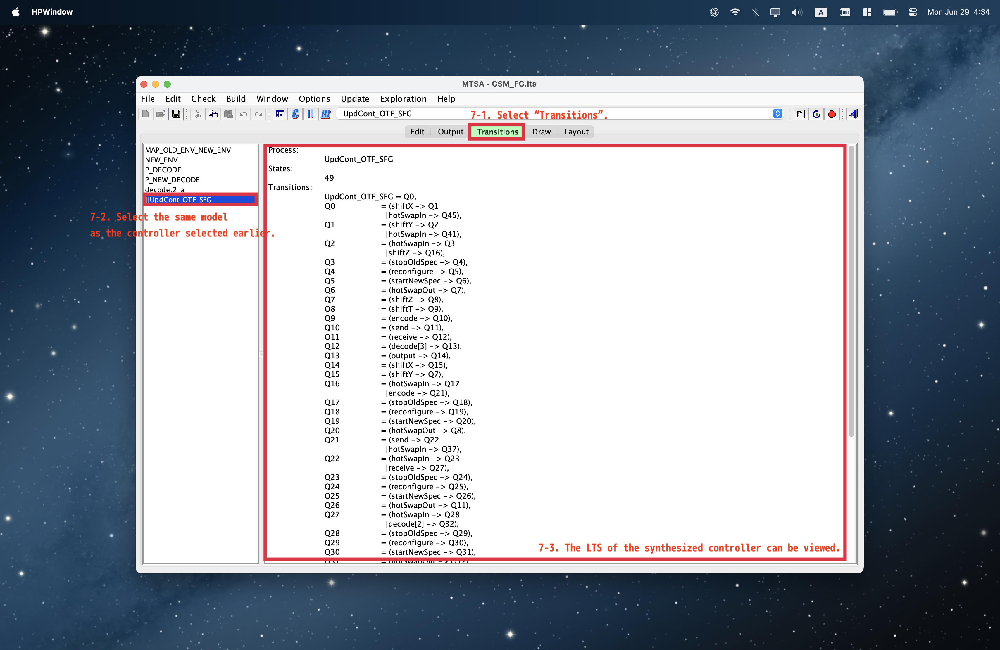
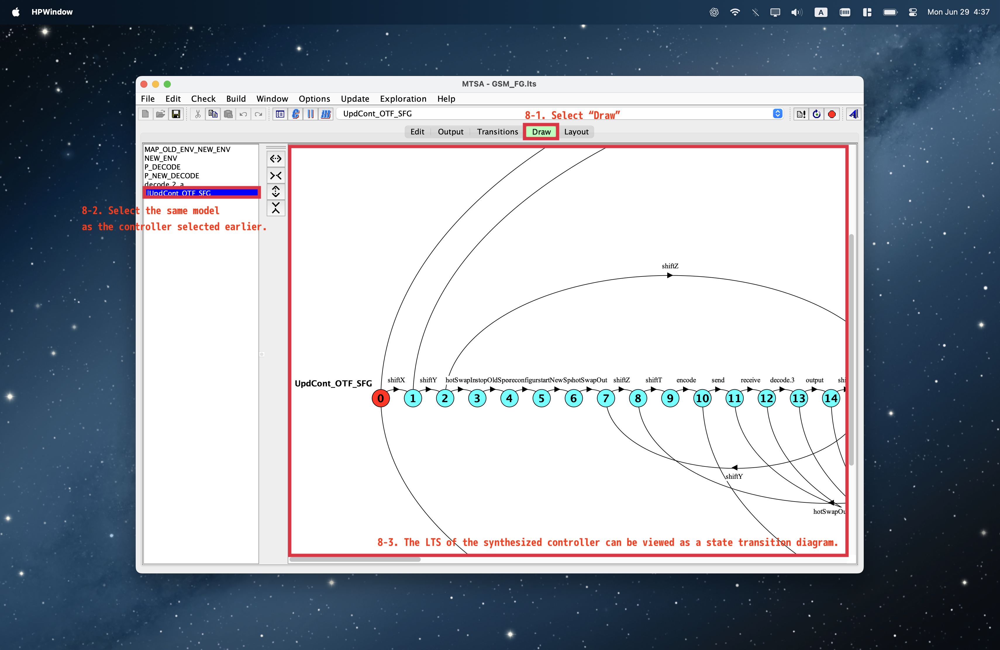
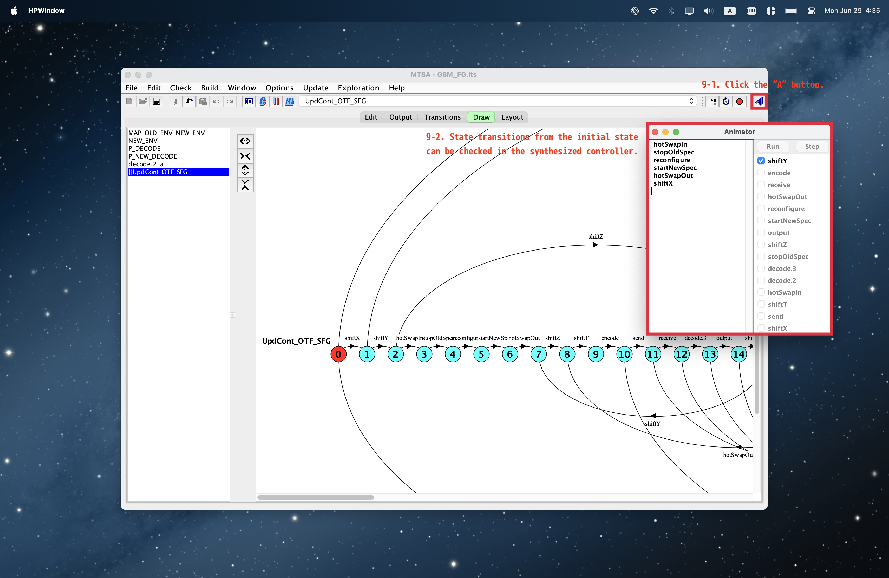

# Fine-Grained Dynamic Controller Update via On-the-Fly Synthesis

This repository contains a research artifact for evaluating fine-grained dynamic
controller update via on-the-fly synthesis. The artifact is based on MTSA/LTSA
and includes benchmark models, experiment configurations, experiment outputs,
and the source code needed to rebuild the executable tool.

For normal use, download and run the prebuilt `mtsa.jar` from GitHub Releases:

https://github.com/iTaku3/Fine-Grained-Dynamic-Controller-Update-via-On-the-Fly-Synthesis/releases/download/v1.0.0/mtsa.jar

Build from source only if you want to inspect or modify the MTSA implementation
itself.

## What The Tool Does

The tool supports synthesis and analysis of controller-update scenarios for
finite-state models written in LTSA/FSP-style `.lts` files. It is used to compare
traditional monolithic controller synthesis with on-the-fly update synthesis,
including variants with and without the abstraction option used in the
experiment files.

The executable is an MTSA-based Java GUI application. It can load `.lts` models,
compile them, and run controller-synthesis/update workflows through the MTSA
interface.

## Repository Layout

```text
.
├── Experiment/
│   ├── Models/
│   ├── Experiment/
│   └── mtsa.jar
└── Source Code/
    └── maven-root/
        ├── mtsa/
        ├── lib/
        └── locallib/
```

## Experiment Directory

`Experiment/` contains the benchmark inputs and recorded experiment data.

- `Experiment/Models/`  
  Top-level benchmark `.lts` models used in the evaluation, such as GSM,
  Industry, MetaSocket, PowerPlant, ProductionCell, Railcab, Surveillance, and
  Workflow.

- `Experiment/Experiment/<date>/configs/`  
  YAML configuration files for dated experiment runs. These files define the
  benchmark model, synthesis/update variant, JVM options, and output directory
  for each run.

- `Experiment/Experiment/<date>/models/`  
  Copies of the benchmark models used for that dated run.

- `Experiment/Experiment/<date>/result/` and related result directories  
  Output files from experiment runs, including metadata, stdout/stderr logs,
  synthesized output, and transition summaries.

- `Experiment/Experiment/result/`  
  Aggregated or post-processed result tables. Large CSV files are tracked with
  Git LFS, not as GitHub Release assets.

- `Experiment/mtsa.jar`  
  Local copy of the prebuilt executable jar. The recommended distribution point
  is the GitHub Release asset linked above.

## Source Code Directory

`Source Code/` contains the Java/Maven project used to build the tool. You only
need this directory if you want to change the MTSA implementation or rebuild the
jar.

- `Source Code/maven-root/mtsa/`  
  Main Maven project. The Maven descriptor is:

  ```text
  Source Code/maven-root/mtsa/pom.xml
  ```

- `Source Code/maven-root/mtsa/src/main/java/`  
  Java source code for MTSA, LTSA UI components, controller synthesis, dynamic
  controller update, enactment, and related utilities.

- `Source Code/maven-root/mtsa/src/main/resources/`  
  Runtime resources used by the GUI, including icons, documentation assets,
  logging configuration, and `ltsa-context.xml`.

- `Source Code/maven-root/mtsa/src/test/` and `src/test/resources/`  
  Test code and additional example models/resources.

- `Source Code/maven-root/mtsa/lib/`  
  Local Maven-style dependencies required by this historical MTSA codebase.
  Some large local dependencies are tracked with Git LFS.

- `Source Code/maven-root/locallib/`  
  Additional local dependency jars used by the project.

- `Source Code/maven-root/mtsa/target/`  
  Maven build output. This directory is ignored by Git and should be regenerated
  locally.

## Recommended Usage

Download and run the prebuilt artifact first. Building from source is only
needed when modifying the MTSA implementation.

1. Download `mtsa.jar` from the release asset:

   https://github.com/iTaku3/Fine-Grained-Dynamic-Controller-Update-via-On-the-Fly-Synthesis/releases/download/v1.0.0/mtsa.jar

2. Run the jar:

   ```bash
   java -jar mtsa.jar
   ```

3. After startup, the MTSA GUI is displayed.

   

4. Click the file-open button to select a model, then open any benchmark `.lts`
   file from `Experiment/Models/` or a dated
   `Experiment/Experiment/<date>/models/` directory.

   

5. The selected model content is displayed in the editor.

   

6. Select the controller to synthesize. The selected controller name determines
   which synthesis method is used:

   - `UpdCont_OTF_SFG`: on-the-fly synthesis with abstract update actions
     (proposed method)
   - `UpdCont_OTF_FG`: on-the-fly synthesis only
   - `UpdCont_SFG`: abstract update actions only
   - `UpdCont_FG`: no extension, corresponding to the traditional method

   If the model name is followed by one of the suffixes below, the update-time
   requirement changes accordingly. See the paper for the details of each
   update-time requirement.

   - `none`: update-time requirement is `none`
   - `R1`: update-time requirement is `R1`
   - `R2`: update-time requirement is `R2`

   

7. Click the `Compose` button. The synthesis log is displayed in the output
   pane.

   

8. To inspect the synthesized controller as transitions, select `Transitions`,
   then select the same model as the controller selected earlier. The LTS of the
   synthesized controller is shown as a transition listing.

   

9. To inspect the synthesized controller as a state transition diagram, select
   `Draw`, then select the same model as the controller selected earlier.

   

10. To animate the synthesized controller, click the `A` button. State
    transitions from the initial state can then be checked interactively.

    

## Cloning The Full Artifact

The repository uses Git LFS for large local libraries and large aggregated CSV
result files. Clone the repository and pull the LFS-managed files:

```bash
git clone https://github.com/iTaku3/Fine-Grained-Dynamic-Controller-Update-via-On-the-Fly-Synthesis.git
cd Fine-Grained-Dynamic-Controller-Update-via-On-the-Fly-Synthesis
git lfs install
git lfs pull
```

This downloads the LFS-managed files needed for the full artifact contents.

## Building From Source

Build from source only when you need to inspect or modify the implementation.
For ordinary artifact use, prefer the prebuilt `mtsa.jar` from GitHub Releases.

Requirements:

- Java JDK 10 or newer
- Apache Maven
- Git LFS, if building from a fresh clone

Build command:

```bash
cd "Source Code/maven-root/mtsa"
mvn install -DskipTests=true
```

The executable shaded jar is produced at:

```text
Source Code/maven-root/mtsa/target/mtsa-1.0-SNAPSHOT.jar
```

Run the rebuilt tool with:

```bash
cd target
java -jar mtsa-1.0-SNAPSHOT.jar
```

The Maven configuration targets Java 10 because the source code uses Java 10
language features.

## Large Files

GitHub Releases intentionally contains only the user-facing executable:

```text
mtsa.jar
```

Large CSV result files and local dependency jars are managed with Git LFS inside
the repository. Maven build outputs under `target/` are ignored and should be
regenerated locally when needed.
